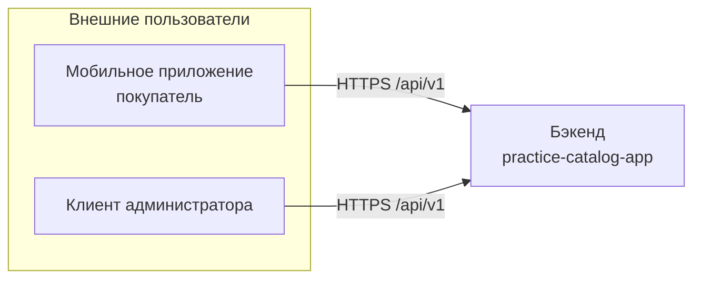
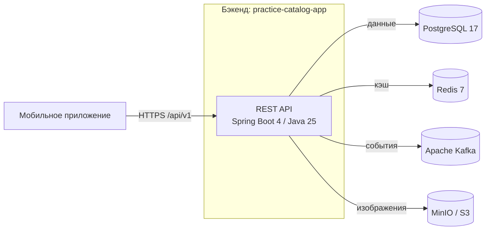
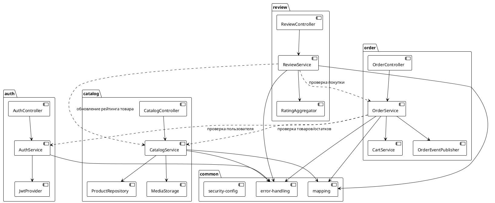
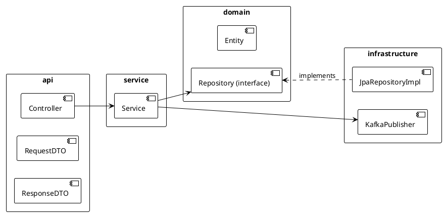
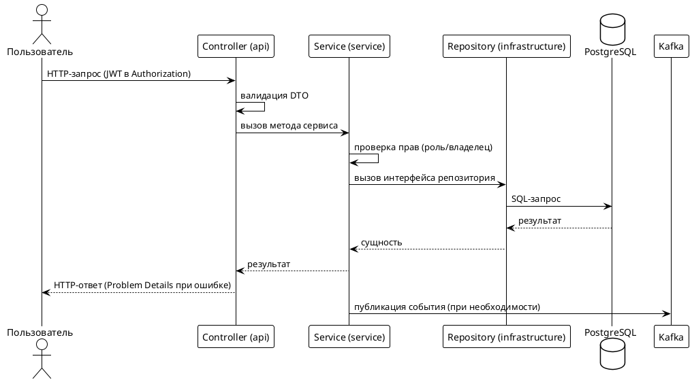

# 01. Архитектура

> Статус: черновик
> Версия: 0.1
> Связанные документы: [02. Модель данных](02-domain-model.md), [03. Дизайн API](03-api-design.md), [04. Аутентификация](04-auth.md)

## 1. Цели и не-цели

### Цели

- Чёткая модульная структура, в которой легко найти код по функциональной области.
- Лёгкий старт: минимум инфраструктуры для локальной разработки, всё поднимается одной командой.
- Готовность к росту: модульные границы позволяют в будущем выносить части системы в отдельные сервисы без переписывания.
- Понятный код для команды: единые конвенции, слои внутри модулей, сквозные механизмы в одном месте.

### Не-цели

- Микросервисная архитектура (отложена; см. раздел 2 — критерии эволюции).
- Распределённые транзакции, saga, event-sourcing.
- Высокая горизонтальная масштабируемость на старте (достаточно репликации БД и кэша).
- Готовность к мультирегиональному развёртыванию.

## 2. Архитектурный стиль: модульный монолит

Система проектируется как **модульный монолит** — одно развёртываемое приложение с чётким разделением на функциональные модули. Внутри процесса модули взаимодействуют напрямую через Java-интерфейсы; для событий, которые важны вне одного модуля, используется Kafka.

### Обоснование выбора

| Критерий | Модульный монолит | Микросервисы |
|---|---|---|
| Сложность локального запуска | Один процесс + инфраструктура | N процессов + инфраструктура |
| Транзакции между областями (заказ + остатки) | Атомарные (одна БД) | Требуют saga/outbox |
| Тестирование | Юнит + Testcontainers | Плюс контрактные тесты, моки сервисов |
| Нагрузка на старте | Достаточно | Избыточна |
| Скорость изменений в команде из 1–3 разработчиков | Высокая | Низкая (согласование контрактов) |

### Критерии эволюции в микросервисы

Модуль можно выделить в отдельный сервис, когда:

1. Наблюдается устойчиво разный жизненный цикл изменений (модуль меняется заметно чаще/реже остальных).
2. Требуется независимое масштабирование под нагрузку (например, чтение каталога vs оформление заказов).
3. Появляется потребность в разных технологиях хранения/вычислений для модуля.
4. Команда разрастается до размера, когда кодовая база одного модуля не помещается в голове.

Кандидаты на выделение в первую очередь: `catalog` (чтение, кэширование, возможен read-model) и `media`-функции (тяжёлый трафик изображений). Критерии принятия решения и последствия фиксируются в ADR (фаза ADR).

## 3. Контекстная схема (C4 Context)



## 4. Контейнеры (C4 Container)



| Контейнер | Назначение | Использование |
|---|---|---|
| **REST API** (Spring Boot 4, Java 25) | Единственная точка входа: каталог, заказы, авторизация, отзывы | Всё бизнес-логика приложения |
| **PostgreSQL 17** | Основное хранилище данных | Все модули, ACID-транзакции |
| **Redis 7** | Кэш категорий, списков и карточек товаров, остатков; временные данные | Модули `catalog`, `order`; инвалидация через Kafka |
| **Apache Kafka** | Шина событий между модулями: заказы, остатки, товары, рейтинги | `order`, `catalog`, `review`; см. [06-events.md](06-events.md) |
| **MinIO / S3** | Хранение изображений товаров и аватаров | Модуль `catalog`; доступ через presigned URL |

## 5. Внутренняя структура: модули

### Состав модулей

| Модуль | Ответственность | Примеры функций |
|---|---|---|
| `auth` | Регистрация, вход, токены, роли | JWT, refresh, профиль |
| `catalog` | Категории, товары, атрибуты, SKU, остатки, изображения, поиск | CRUD каталога, фильтры |
| `order` | Корзина, заказы, статусы, избранное | Оформление заказа, история |
| `review` | Отзывы и рейтинги товаров | Только для покупателей, агрегация рейтинга |
| `common` | Общие утилиты и сквозные механизмы | Ошибки, маппинг, security-конфигурация |

### Диаграмма зависимостей модулей (PlantUML component)



### Правила зависимостей

1. Зависимости модулей — **однонаправленные**, допустимые связи показаны на диаграмме выше.
2. `common` — единственный модуль, от которого могут зависеть все; он не зависит ни от кого.
3. Код, нужный двум и более модулям (кроме `common`), переносится в `common` или переосмысливается — прямые связи между чужими модулями запрещены.
4. Циклические зависимости запрещены (контролируются на ревью; при росте — отдельным плагином сборки).
5. Kafka-события не создают зависимостей между модулями: издатель и подписчик знают только схему события.

### Слои внутри модуля

Каждый модуль (кроме `common`) делится на слои:

```
<module>/
├── api/             # REST-контроллеры, DTO запросов/ответов, валидация
├── service/         # бизнес-логика, транзакции, оркестрация
├── domain/          # сущности, value-объекты, интерфейсы репозиториев
└── infrastructure/  # реализация репозиториев (JPA), клиенты Kafka, хранилища
```

Правила обращений:

- `api` → `service` → `domain` → `infrastructure`.
- `api` не обращается к `infrastructure` и `domain` напрямую.
- `domain` не знает о `api` и `infrastructure` (зависимости через интерфейсы).
- `infrastructure` реализует интерфейсы `domain`; внедрение — через Spring DI.



## 6. Сквозные механизмы (cross-cutting)

Реализуются в модуле `common` и применяются во всех модулях.

### Обработка ошибок

- Единый формат ошибок — [RFC 9457 Problem Details](https://www.rfc-editor.org/rfc/rfc9457).
- Централизованный `@RestControllerAdvice`: маппинг исключений на HTTP-коды.
- Доменные ошибки — типизированные исключения в `common` (например, `ResourceNotFoundException`, `ConflictException`).
- Валидация входящих данных — Jakarta Validation на DTO (`@Valid`), ошибки конвертируются в Problem Details.

### Маппинг DTO

- Маппинг entity ↔ DTO выполняется MapStruct.
- DTO не покидают границы слоя: контроллеры не видят сущности, сервисы не видят DTO запросов.
- Поля дат — ISO-8601, UTC.

### Безопасность

- JWT access/refresh токены, роли `USER` и `ADMIN`.
- Доступ к эндпоинтам — декларативно (`@PreAuthorize`/`SecurityFilterChain`).
- Детали — в [04-auth.md](04-auth.md).

### Sequence-диаграмма типового запроса (PlantUML)



## 7. Конвенции кода

Формальные линтеры (Checkstyle, Spotless) на старте **не используются** — только согласованные конвенции, контролируемые на код-ревью.

- **Пакеты:** `com.practice.catalog.<module>.<слой>` — например, `com.practice.catalog.order.service`.
- **Именование классов:** существительные в PascalCase: `OrderService`, `CreateOrderRequest`, `OrderStatus`.
- **Именование методов:** глаголы в camelCase: `createOrder`, `findById`, `updateStock`.
- **DTO:** суффиксы `Request`/`Response` (`CreateProductRequest`, `ProductResponse`); поисковые запросы — `*Query` (`ProductSearchQuery`).
- **Сущности:** JPA-сущности без суффикса; интерфейсы репозиториев — `<Entity>Repository`.
- **Константы** — в `static final`, имена UPPER_SNAKE_CASE; магические числа запрещены.
- **Логирование:** через SLF4J `LoggerFactory.getLogger(...)`, уровень ошибки соответствует важности; без `System.out`.
- **Транзакции:** `@Transactional` на уровне сервиса; только чтение помечается `readOnly = true`.
- **Стиль:** без комментариев-излишеств, самодокументирующийся код; javadoc только на публичных контрактах модулей.
- **Коммиты и ветки:** feature-ветки от `main`, сообщения по Conventional Commits (фиксация в ADR при необходимости).

## 8. Наблюдаемость

- **Actuator:** эндпоинты `health`, `info`, `metrics`, `prometheus` (включены, но без развёртывания Prometheus в v1).
- **Логирование:** Logback; structured-логирование через `logstash-logback-encoder` (JSON в проде, человекочитаемый формат в dev-профиле).
- **Идентификация запроса:** `traceId`/`spanId` прокидываются из HTTP-заголовка `X-Request-Id`, попадают в логи.
- **Kafka:** клиентские метрики (задержки, ошибки) и логи обработчиков с `traceId`.

## 9. Тестирование

### Пирамида тестов

| Уровень | Технологии | Что покрываем |
|---|---|---|
| Юнит | JUnit 5, Mockito | Сервисы, мапперы, валидация, чистые функции |
| Интеграционные | Spring Boot Test + Testcontainers | Слои Repository ↔ PostgreSQL, Kafka-производители/потребители, Redis-кэш |
| Слоистые (slice) | `@WebMvcTest`, `@DataJpaTest` | Контроллеры (с моком сервиса), репозитории |
| E2E (выборочно) | Testcontainers (полный стек) | Ключевые сценарии: оформление заказа, поиск, отзыв после покупки |

### Правила

- Тестовая БД/Redis/Kafka/MinIO поднимаются через Testcontainers; `application-test.yml` — отдельный профиль.
- База данных в тестах — реальный PostgreSQL (без H2): поведение full-text поиска, JSONB и ограничений должно совпадать с продуктионом.
- Минимальное покрытие: сервисные слои ≥ 80% строк; новые публичные методы без тестов на ревью не принимаются.
- Тесты изолированы: запрещено зависеть от порядка выполнения.

## 10. Ссылки на смежные документы

- [02. Модель данных](02-domain-model.md) — сущности, связи, ERD.
- [03. Дизайн API](03-api-design.md) — ресурсы REST, версионирование, ошибки.
- [04. Аутентификация](04-auth.md) — JWT, роли, регистрация.
- [06. События](06-events.md) — топики Kafka и схемы событий.
- [08. Запуск и окружения](08-setup.md) — docker-compose, профили, переменные окружения.