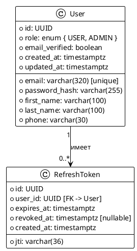
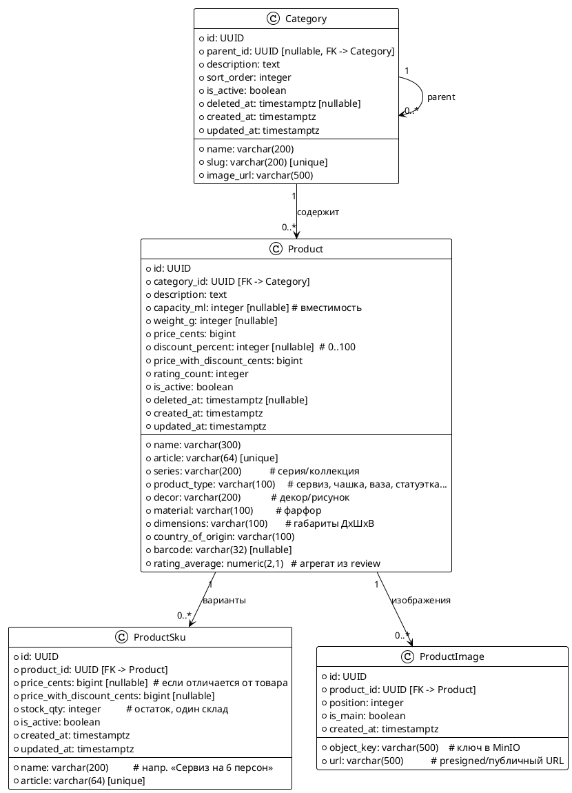
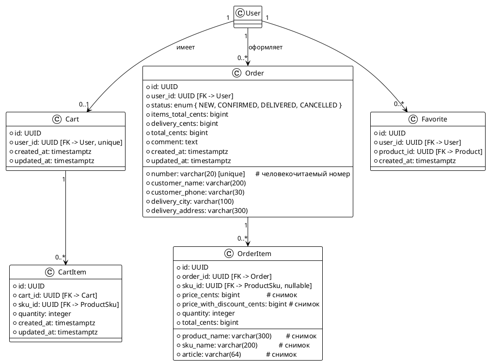
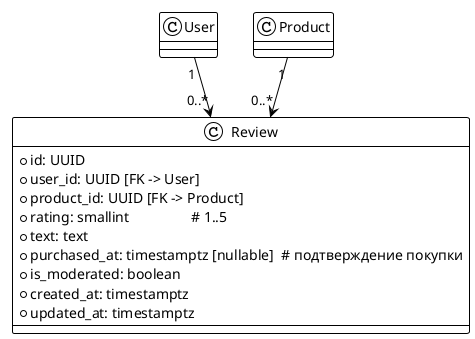
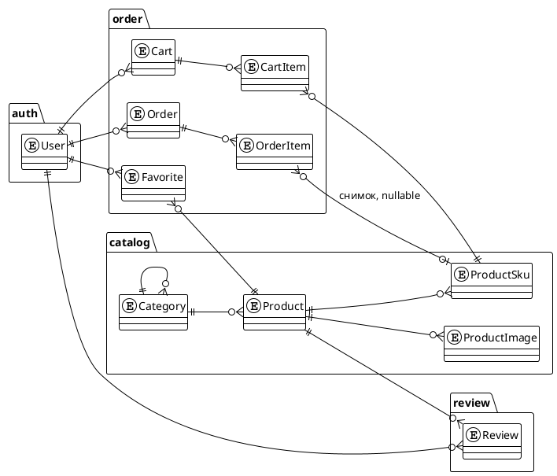

# 02. Модель данных

> Статус: черновик
> Версия: 0.1
> Связанные документы: [01. Архитектура](01-architecture.md), [03. Дизайн API](03-api-design.md), [05. Заказы](05-orders.md)

## 1. Общие принципы

- **Идентификаторы:** UUID (v7 или v4) для всех сущностей. UUID скрывает порядок создания записей и удобен для мобильного API (без утечки информации о количестве записей).
- **Аудит:** у каждой сущности поля `created_at`, `updated_at` (заполняются приложением, UTC).
- **Мягкое удаление (soft delete):** поле `deleted_at` у товаров и категорий. Физическое удаление запрещено; удалённые записи исключаются из выборок (глобальный фильтр в репозиториях).
- **Деньги:** целое число в копейках (`bigint`/`integer`), без `float`/`double`. Валюта одна — BYN. Хранение в малых единицах исключает ошибки округления.
- **Даты:** `timestamp with time zone`, всегда UTC. В API — ISO-8601.
- **Остатки:** только на уровне SKU (варианта товара), один склад в v1.
- **Снимки:** данные, влияющие на документ (цены, названия), копируются в документ на момент создания — заказ не меняется при изменении каталога.
- **Рейтинг:** агрегированное значение хранится на товаре (`rating_average`, `rating_count`) и обновляется асинхронно по событию из модуля `review` (см. [06-events.md](06-events.md)).

## 2. Модуль auth

| Таблица | Описание |
|---|---|
| `users` | Пользователи; `email` уникален, пароль — bcrypt (72 байта); роль определяет доступ (USER/ADMIN). |
| `refresh_tokens` | Refresh-токены: `jti` уникален, `revoked_at` для ротации/отзыва; одноразовые, при использовании заменяются. |

Детали жизненного цикла токенов — в [04-auth.md](04-auth.md).

## 3. Модуль catalog

| Таблица | Описание |
|---|---|
| `categories` | Дерево категорий: `parent_id` ссылается на родителя (adjacency list); глубина не ограничена, но на практике ≤ 3. Подкатегории выбираются рекурсивным CTE. |
| `products` | Товар с фиксированными характеристиками (специфика фарфоровых изделий: серия, тип изделия, декор, вместимость). Цены в копейках. |
| `product_skus` | Варианты товара: набор, персона, цвет и т.п. Остаток и опциональная своя цена живут здесь. Товар без активных SKU не продаётся. |
| `product_images` | Изображения в MinIO; `is_main` — главное фото (одно на товар, контролируется приложением); порядок — `position`. |

Правила цен:

- `price_with_discount_cents` вычисляется при сохранении: `price_cents * (100 - discount_percent) / 100`, хранится материализованно.
- Скидка применяется на уровне товара или SKU; SKU с собственной ценой может иметь собственную скидку.
- Изменение цены порождает событие `product.updated` (инвалидация кэша, см. [06-events.md](06-events.md)).

## 4. Модуль order

| Таблица | Описание |
|---|---|
| `carts` / `cart_items` | Корзина: одна на пользователя; элементы ссылаются на SKU; количество > 0, верхняя граница задаётся конфигурацией. |
| `orders` | Заказ: статус, суммы (товары + доставка), контакты и адрес получателя. Оплата оффлайн — отдельного платёжного состояния нет, статус `CONFIRMED` фиксирует принятие заказа. |
| `order_items` | **Снимок** товара на момент заказа: название, артикул, цены копируются; при удалении/изменении товара заказ остаётся корректным. |
| `favorites` | Избранное: пара `(user_id, product_id)` уникальна; добавление идемпотентно. |

Статусы заказа и правила переходов — в [05-orders.md](05-orders.md).

## 5. Модуль review

| Таблица | Описание |
|---|---|
| `reviews` | Отзыв: оценка 1–5 и текст. Пара `(user_id, product_id)` уникальна — один отзыв на товар. Оставить отзыв может только пользователь, купивший этот товар (проверка по `order_items` через снимок SKU → товар). |

Согласованность:

- При публикации/изменении/удалении отзыва модуль `review` публикует событие `review.rating.updated`; подписчик пересчитывает `rating_average` и `rating_count` на товаре (взвешенное среднее, округление до 0,1).

## 6. Сводная схема связей между модулями

## 7. Словари и статусы

### OrderStatus

| Статус | Описание | Допустимые переходы |
|---|---|---|
| `NEW` | Создан, ожидает подтверждения оператором | → `CONFIRMED`, → `CANCELLED` |
| `CONFIRMED` | Подтверждён, передан в сборку/доставку | → `DELIVERED`, → `CANCELLED` |
| `DELIVERED` | Доставлен, оплачен при получении | терминальный |
| `CANCELLED` | Отменён (пользователем или оператором) | терминальный |

### Роли

| Роль | Права |
|---|---|
| `USER` | Просмотр каталога, корзина, заказы, избранное, отзывы |
| `ADMIN` | Всё, что `USER`, плюс CRUD категорий/товаров/SKU/изображений, смена статусов заказов, модерация отзывов |

### Типы изделий (справочные значения `product_type`, расширяемые)

сервиз, чайная пара, чашка, блюдце, тарелка, ваза, статуэтка, сувенир, сахарница, молочник

## 8. Индексы и уникальные ограничения

| Таблица | Индексы / ограничения | Назначение |
|---|---|---|
| `users` | `uk_users_email` (unique), idx на `role` | Вход по email, выборки по роли |
| `refresh_tokens` | `uk_refresh_jti` (unique), idx `(user_id)`, idx `(expires_at)` | Ротация, отзыв, очистка просроченных |
| `categories` | idx `(parent_id)`, `uk_categories_slug` (unique, partial `WHERE deleted_at IS NULL`) | Рекурсивные CTE, slug в URL |
| `products` | idx `(category_id)`, idx GIN `(name gin_trgm_ops)`, idx `(series)`, `uk_products_article` (unique, partial), idx `(price_with_discount_cents)`, idx `(is_active, deleted_at)` | Поиск (pg_trgm), фильтры, сортировка по цене |
| `product_skus` | idx `(product_id)`, `uk_skus_article` (unique, partial) | Карточка товара, остатки |
| `product_images` | idx `(product_id, position)` | Порядок изображений |
| `cart_items` | idx `(cart_id)`, `uk_cart_items_sku` (unique `(cart_id, sku_id)`) | Содержимое корзины |
| `orders` | idx `(user_id, created_at desc)`, idx `(status)`, `uk_orders_number` (unique) | История заказов, списки по статусу |
| `order_items` | idx `(order_id)`, idx `(sku_id)` | Детали заказа, проверка покупки для отзывов |
| `favorites` | `uk_favorites_user_product` (unique `(user_id, product_id)`), idx `(user_id)` | Избранное пользователя |
| `reviews` | `uk_reviews_user_product` (unique `(user_id, product_id)`), idx `(product_id, created_at desc)` | Один отзыв на товар, списки отзывов |

Примечание: partial-индексы используются с soft delete (`WHERE deleted_at IS NULL`), чтобы сохранить уникальность артикулов и slug среди активных записей.