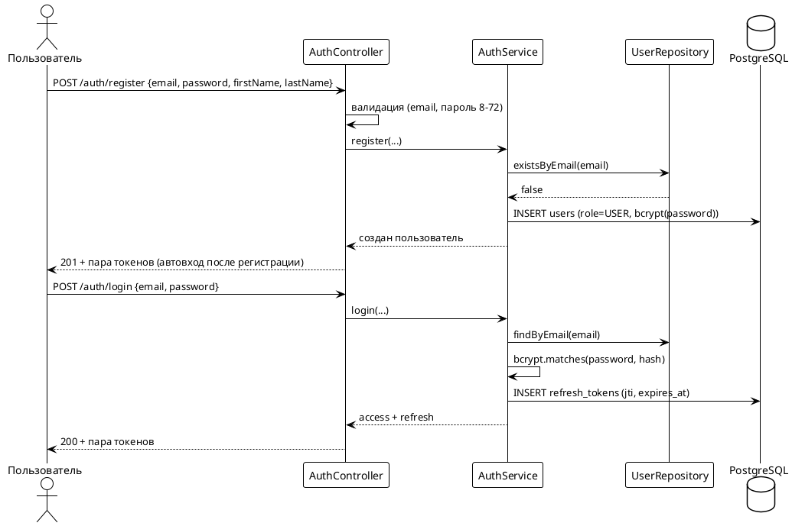
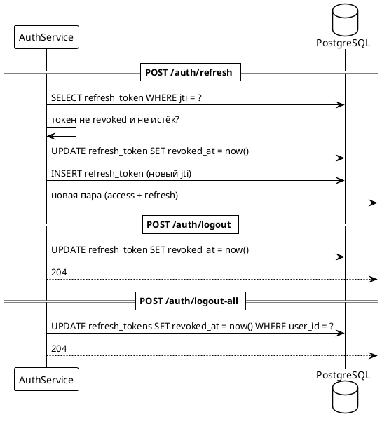

# 04. Аутентификация

> Статус: черновик
> Версия: 0.1
> Связанные документы: [01. Архитектура](01-architecture.md), [02. Модель данных](02-domain-model.md), [03. Дизайн API](03-api-design.md)

## 1. Общие принципы

- **Пара токенов:**
  - `access` — короткоживущий JWT, 15 минут, подтверждает личность в каждом запросе.
  - `refresh` — долгоживущий JWT, 30 дней, используется только для получения новой пары.
- **Ротация refresh-токенов:** каждый refresh-токен одноразовый; при обращении к `/auth/refresh` старая запись помечается `revoked_at`, выдаётся новая пара. Это защищает от перехвата: повторное использование старого токена означает компрометацию.
- **Хранение паролей:** bcrypt (стоимость 12); пароль в открытом виде нигде не хранится и не логируется.
- **Алгоритм подписи JWT:** HS256, секрет — из переменной окружения `JWT_SECRET` (≥ 32 байта). RS256 не требуется: ключи подписи и проверки находятся в одном приложении (модульный монолит).
- **Часовой пояс:** все временные метки токенов — UNIX-время (UTC).

## 2. Потоки аутентификации

### Регистрация и вход



### Ротация refresh и logout



### Смена пароля

- Авторизованный пользователь отправляет `POST /auth/change-password`:
  `{ currentPassword, newPassword, newPasswordConfirm }`.
- Проверки: текущий пароль совпадает (bcrypt); `newPassword == newPasswordConfirm`; длина 8–72; новый пароль не равен текущему.
- При успехе: пароль обновлён, **все refresh-токены пользователя отзываются** (полный logout со всех устройств) — пользователь перелогинивается.
- Ответ: 204.

### Редактирование профиля

- Авторизованный пользователь отправляет `PATCH /auth/me`:
  `{ firstName?, lastName?, phone? }` — частичное обновление, минимум одно поле; `phone: null` очищает телефон.
- Проверки: имя и фамилия от 1 до 100 символов; телефон до 30 символов.
- `email`, `role` и пароль через этот эндпоинт не меняются (смена пароля — отдельный эндпоинт выше).
- Ответ: 200 с обновлённым профилем в формате ответа `GET /auth/me`; `updated_at` обновляется.

## 3. Токены

### Access-токен (claims)

```json
{
  "sub": "7c9e6679-7425-40de-944b-e07fc1f90ae7",
  "role": "USER",
  "jti": "b1c2...",
  "iat": 1787116800,
  "exp": 1787117700,
  "iss": "practice-catalog-app",
  "aud": "practice-catalog-mobile"
}
```

- `sub` — UUID пользователя; `role` — роль (USER/ADMIN); `jti` — уникальный идентификатор токена.
- Проверка на каждом защищённом запросе: подпись, `exp`, `iss`/`aud`, пользователь существует и не заблокирован.
- Access-токен **stateless**: отозвать отдельный access до истечения нельзя; при необходимости полного отзыва — отзыв всех refresh (пользователь не сможет получить новую пару).

### Refresh-токен

- Хранится в БД (`refresh_tokens`): `jti`, `user_id`, `expires_at`, `revoked_at`.
- Одноразовый: ротация при каждом использовании; повторное использование отозванного токена → 401 и **отзыв всех refresh-токенов пользователя** (подозрение на кражу).
- Срок жизни 30 дней; при истечении — повторный вход.
- Очистка просроченных записей — фоновая задача (ежедневно).

### Ответы аутентификации

Успешный вход/регистрация/refresh:

```json
{
  "accessToken": "eyJhbGciOiJIUzI1NiIs...",
  "expiresIn": 900,
  "refreshToken": "eyJhbGciOiJIUzI1NiIs...",
  "refreshExpiresIn": 2592000
}
```

## 4. Эндпоинты

| Метод | Путь | Доступ | Описание |
|---|---|---|---|
| `POST` | `/api/v1/auth/register` | публичный | Регистрация; `{ email, password, firstName, lastName, phone? }` → 201 + пара токенов |
| `POST` | `/api/v1/auth/login` | публичный | Вход по email/паролю → 200 + пара токенов |
| `POST` | `/api/v1/auth/refresh` | публичный (по refresh) | Ротация → 200 + новая пара |
| `POST` | `/api/v1/auth/logout` | USER/ADMIN | Отзыв текущего refresh → 204 |
| `POST` | `/api/v1/auth/logout-all` | USER/ADMIN | Отзыв всех refresh пользователя → 204 |
| `POST` | `/api/v1/auth/change-password` | USER/ADMIN | Смена пароля + полный logout → 204 |
| `GET` | `/api/v1/auth/me` | USER/ADMIN | Профиль текущего пользователя → 200 |
| `PATCH` | `/api/v1/auth/me` | USER/ADMIN | Редактирование профиля: `{ firstName?, lastName?, phone? }` → 200 |

### Коды ошибок

| Код | Сценарий |
|---|---|
| 400 | Ошибка валидации (формат email, длина пароля) |
| 401 | Неверные email/пароль при входе; просрочен/отозван/повторно использован refresh |
| 409 | Email уже зарегистрирован; новый пароль совпадает с текущим |
| 422 | `newPassword != newPasswordConfirm` |

## 5. Роли и доступ

| Роль | Права |
|---|---|
| `USER` | Каталог, корзина, заказы (свои), избранное, отзывы, профиль |
| `ADMIN` | Всё из USER + управление каталогом, заказами (все), модерация отзывов |

- Роли задаются **только при создании записи** (`role` в `users`); смена роли через API запрещена.
- Защита декларативная: `SecurityFilterChain` задаёт правила по путям, внутри — `@PreAuthorize` для тонких проверок (владелец ресурса, роль).
- **Создание админа:** первый администратор создаётся seed-скриптом / переменной окружения `ADMIN_EMAIL`, `ADMIN_PASSWORD` при старте (только если админов ещё нет). Через публичную регистрацию получить роль ADMIN нельзя.

## 6. Принятые риски v1 (задокументированные решения)

| Риск | Решение в v1 | Последствие | Когда закрывать |
|---|---|---|---|
| Нет верификации email | Поле `email_verified` в модели, но не проверяется | Захват чужих email при регистрации | При появлении писем (SMTP) — фаза 2 |
| Нет восстановления пароля | Только смена пароля авторизованным | Потерявший пароль заводит новый аккаунт / обращается к оператору | При появлении SMTP — ссылка с одноразовым кодом |
| Нет рейт-лимитов на login/register | Отсутствуют | Перебор паролей возможен | Redis уже в стеке — рейт-лимиты подключаются конфигурацией |
| Нет двухфакторной аутентификации | Отсутствует | Скомпрометированный пароль открывает аккаунт | Вне планов v1; решение в ADR при необходимости |

Риски фиксированы как принятые осознанно; закрываются по фазам, описанным в [09-roadmap.md](09-roadmap.md).