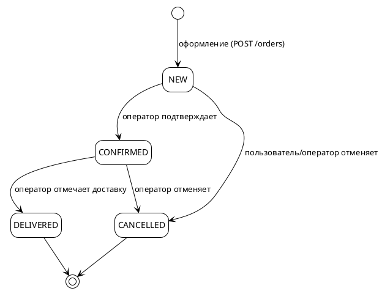

# 05. Заказы

> Статус: черновик
> Версия: 0.1
> Связанные документы: [02. Модель данных](02-domain-model.md), [03. Дизайн API](03-api-design.md), [06. События](06-events.md)

## 1. Поток заказа



Общая схема:

1. Пользователь наполняет корзину (SKU, количество).
2. `POST /api/v1/orders` — оформление: остатки списываются, заказ создаётся со снимками, корзина очищается.
3. Заказ в статусе `NEW` ожидает оператора.
4. Оператор подтверждает (`CONFIRMED`) — заказ передан в сборку/доставку.
5. Доставка завершена (`DELIVERED`) — заказ закрыт. Оплата — оффлайн (наличными/при получении), платёжного состояния в системе нет.
6. Отмена возможна: пользователем в `NEW`, оператором в `NEW`/`CONFIRMED`.

## 2. Корзина

- Одна корзина на пользователя (`carts.user_id` уникален), создаётся лениво при первом добавлении.
- **Лимиты:** до 999 шт. на позицию, до 100 позиций в корзине. Превышение → 400 (валидация) / 409 (конфликт при повторном добавлении).
- **Цены при чтении** пересчитываются из текущих данных каталога: `GET /cart` возвращает актуальные цены, суммы и `totalCents`.
- **Недоступные позиции:** если SKU деактивирован, товар неактивен или мягко удалён — позиция помечается `unavailable: true` в ответе, исключается из оформления, но остаётся в корзине до удаления пользователем.
- **Остаток:** количество не может превышать текущий остаток SKU (422 при превышении); при уменьшении остатка ниже количества в корзине позиция помечается `unavailable` с причиной `insufficient-stock`.

## 3. Оформление заказа (POST /orders)

Выполняется **в одной транзакции**:

```
1. Загрузить корзину пользователя (позиции)
2. Для каждой позиции:
   - SELECT ... FOR UPDATE по SKU (пессимистическая блокировка)
   - проверить is_active товара и SKU, остаток >= quantity
   - списать остаток: stock_qty -= quantity
3. Создать Order (статус NEW, суммы, контакты, адрес)
4. Создать OrderItem-снимки: productName, skuName, article,
   priceCents, priceWithDiscountCents, quantity, totalCents
5. Очистить корзину
6. Публикация событий: order.created, stock.updated (после COMMIT)
```

- **Конкурентность:** блокировка `FOR UPDATE` исключает двойное списание одного остатка параллельными заказами; при конфликте — повторная проверка и 422.
- **Недостаточный остаток:** 422 Problem Details со списком позиций `[{ skuId, requested, available }]`; транзакция откатывается, корзина не меняется.
- **Номер заказа:** `ORD-YYYY-######` (год + последовательный номер, генерируется в транзакции; уникальность — уникальным индексом).
- **Доставка в v1 бесплатная:** `deliveryCents = 0`; поле остаётся в модели для будущих тарифов.
- **Идемпотентность:** повторный запрос с тем же `X-Request-Id` не создаёт второй заказ — возвращается ранее созданный (201/200).

### Валидация запроса

| Поле | Правило |
|---|---|
| `customerName` | от 2 до 200 символов |
| `customerPhone` | от 6 до 30 символов |
| `deliveryCity` | обязателен, до 100 символов |
| `deliveryAddress` | обязателен, до 300 символов |
| `comment` | опционально, до 1000 символов |

## 4. Статусы и переходы

| Переход | Инициатор | Условия | Побочные эффекты |
|---|---|---|---|
| `NEW → CONFIRMED` | оператор (ADMIN) | статус `NEW` | нет |
| `NEW → CANCELLED` | пользователь или оператор | статус `NEW` | возврат остатков, `stock.updated` |
| `CONFIRMED → DELIVERED` | оператор | статус `CONFIRMED` | нет |
| `CONFIRMED → CANCELLED` | оператор | статус `CONFIRMED` | возврат остатков, `stock.updated` |
| `DELIVERED → *` | — | запрещено | — |
| `CANCELLED → *` | — | запрещено | — |

- **Возврат остатков при отмене:** `stock_qty += quantity` по каждому `order_item` (списание происходило при оформлении), публикуется `stock.updated`.
- **Идемпотентность переходов:** `PATCH /admin/orders/{id}/status` со статусом, равным текущему, → 200 без изменений и без повторных событий; недопустимый переход → 409.
- **История переходов:** фиксируется в `updated_at`; полная история статусов с оператором и временем — поле `status_history` (JSONB) на заказе, заполняется при каждом переходе (для отчётности и разбора).

## 5. Консистентность и снимки

- **Снимок в `order_items`** (названия, артикулы, цены, скидки) фиксируется при оформлении: последующие изменения каталога (цена, переименование, мягкое удаление товара) не влияют на существующие заказы.
- **Суммы заказа:** `itemsTotalCents` = Σ `order_items.total_cents`; `totalCents` = `itemsTotalCents + deliveryCents`; вычисляются и хранятся при создании.
- **Связь с каталогом:** `order_items.sku_id` хранится (nullable — товар мог быть мягко удалён) для проверки права на отзыв и аналитики.
- **Уведомления:** событийные уведомления клиента (push/SMS) — вне v1 (см. [09-roadmap.md](09-roadmap.md)); в v1 изменения статусов видимы по запросу `GET /orders/{id}`.

## 6. События и подписчики

| Событие | Момент | Потребители |
|---|---|---|
| `order.created` | после COMMIT оформления | уведомления (в будущем), аналитика |
| `order.status.changed` | после каждого перехода статуса | уведомления (в будущем), аналитика |
| `stock.updated` | после списания/возврата остатков | `catalog`: инвалидация кэша остатков и наличия в списках |

Схемы событий — в [06-events.md](06-events.md). Публикация — после успешного COMMIT (transactional outbox, см. 06).

## 7. Право на отзыв

- Право оставить отзыв на товар появляется после заказа со статусом **`DELIVERED`**, содержащего SKU этого товара.
- Проверка: существует `order` пользователя со статусом `DELIVERED` и `order_item.sku_id` → товар (`order_items` → `product_skus.product_id`).
- Один отзыв на товар (уникальность `user_id + product_id`), детали — в [02-domain-model.md](02-domain-model.md), раздел «Модуль review».