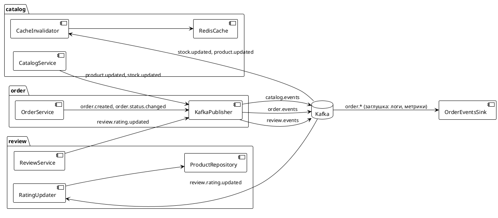

# 06. События

> Статус: черновик
> Версия: 0.1
> Связанные документы: [01. Архитектура](01-architecture.md), [05. Заказы](05-orders.md), [09. Roadmap](09-roadmap.md)

## 1. Принципы

- **Формат:** JSON, без Schema Registry — схемы версионируются внутри поля `eventType` (мажорная версия в имени, например `stock.updated.v1`), эволюция через добавление опциональных полей.
- **Топики:** один топик на модуль-источник: `catalog.events`, `order.events`, `review.events`. Тип события — в поле `eventType`.
- **Публикация после COMMIT:** событие публикуется только после успешного завершения транзакции БД.
- **Гарантии:** at-least-once (клиент может повторить) + идемпотентная обработка по `eventId`.
- **Принятый риск:** сбой между COMMIT и публикацией теряет событие. Для v1 допустимо (потери приводят лишь к устаревшему кэшу/рейтингу, которые исправляются инвалидацией или пересчётом). Закрытие риска — transactional outbox (см. [09-roadmap.md](09-roadmap.md), фаза 2).
- **Порядок:** key сообщения = id ресурса (например, `productId` для `product.updated`, `skuId` для `stock.updated`) → события одного ресурса попадают в одну партицию и обрабатываются по порядку.

## 2. Конверт события

Все события имеют единый конверт:

```json
{
  "eventId": "9f2c8d1e-4b3a-4c1e-9f2c-8d1e4b3a4c1e",
  "eventType": "stock.updated.v1",
  "source": "catalog",
  "occurredAt": "2026-08-17T12:00:00Z",
  "traceId": "f7a2c9d1-...",
  "payload": { }
}
```

| Поле | Описание |
|---|---|
| `eventId` | UUID события; используется для идемпотентной обработки |
| `eventType` | Тип события с версией схемы (`<домен>.<действие>.v<N>`) |
| `source` | Модуль-источник: `catalog`, `order`, `review` |
| `occurredAt` | Момент возникновения (UTC, ISO-8601) |
| `traceId` | Сквозной идентификатор запроса/операции (для трассировки) |
| `payload` | Данные события, зависят от типа |

## 3. Топики и события

### catalog.events

| Событие | Триггер | Payload (ключевые поля) |
|---|---|---|
| `product.created.v1` | создание товара | `{ productId, categoryId, isActive }` |
| `product.updated.v1` | изменение товара (цена, скидка, активность, soft delete) | `{ productId, priceCents, priceWithDiscountCents, discountPercent, isActive, deletedAt }` |
| `stock.updated.v1` | списание/возврат остатка (оформление, отмена заказа), ручная корректировка | `{ skuId, productId, stockQty, delta }` |

### order.events

| Событие | Триггер | Payload (ключевые поля) |
|---|---|---|
| `order.created.v1` | успешное оформление заказа | `{ orderId, number, userId, totalCents, items: [{ skuId, productId, quantity, totalCents }] }` |
| `order.status.changed.v1` | каждый переход статуса | `{ orderId, number, from, to, changedBy, changedAt }` |

### review.events

| Событие | Триггер | Payload (ключевые поля) |
|---|---|---|
| `review.rating.updated.v1` | создание/изменение/удаление отзыва, смена модерации | `{ productId, reviewId, rating, isModerated, action }` |

## 4. Схемы событий (примеры)

### stock.updated.v1

```json
{
  "eventId": "9f2c8d1e-...",
  "eventType": "stock.updated.v1",
  "source": "catalog",
  "occurredAt": "2026-08-17T12:00:00Z",
  "traceId": "f7a2c9d1-...",
  "payload": {
    "skuId": "s1",
    "productId": "7c9e6679-...",
    "stockQty": 13,
    "delta": -1
  }
}
```

### product.updated.v1

```json
{
  "eventId": "8b1e...",
  "eventType": "product.updated.v1",
  "source": "catalog",
  "occurredAt": "2026-08-17T12:05:00Z",
  "traceId": "a3f4...",
  "payload": {
    "productId": "7c9e6679-...",
    "priceCents": 120000,
    "priceWithDiscountCents": 102000,
    "discountPercent": 15,
    "isActive": true,
    "deletedAt": null
  }
}
```

### order.created.v1

```json
{
  "eventId": "5d2e...",
  "eventType": "order.created.v1",
  "source": "order",
  "occurredAt": "2026-08-17T12:10:00Z",
  "traceId": "b7c8...",
  "payload": {
    "orderId": "9f2c...",
    "number": "ORD-2026-000123",
    "userId": "7c9e6679-...",
    "totalCents": 102000,
    "items": [
      {
        "skuId": "s1",
        "productId": "7c9e6679-...",
        "quantity": 1,
        "totalCents": 102000
      }
    ]
  }
}
```

### review.rating.updated.v1

```json
{
  "eventId": "3c1e...",
  "eventType": "review.rating.updated.v1",
  "source": "review",
  "occurredAt": "2026-08-17T12:15:00Z",
  "traceId": "c9d1...",
  "payload": {
    "productId": "7c9e6679-...",
    "reviewId": "a1b2...",
    "rating": 5,
    "isModerated": true,
    "action": "CREATED"
  }
}
```

## 5. Потребители в v1



| Потребитель | События | Действие |
|---|---|---|
| **Каталог / инвалидация кэша** | `stock.updated`, `product.updated` | Удаляет/обновляет ключи Redis: карточка товара, списки (если затронут фильтр наличия/цены), остатки |
| **Рейтинги** | `review.rating.updated` | Пересчёт `rating_average`/`rating_count` товара (учитывает только `isModerated = true`) |
| **Заглушка order.\*** | `order.created`, `order.status.changed` | Логирование и метрики; в v2 — уведомления, аналитика |

Правила потребителей:

- Обработка идемпотентна по `eventId` (ключ в Redis с TTL 24 часа; при отсутствии Redis — уникальный индекс в БД).
- Потребитель, не разобравший событие (неизвестная версия), логирует и не блокирует консьюмер-группу.
- Пересчёт рейтинга — полноценный пересчёт по `AVG(rating)` по отзывам товара (не дельта-обновление), чтобы исключить дрейф.

## 6. Надёжность

- **at-least-once:** клиент может повторить доставку; обработчики обязаны быть идемпотентными.
- **Порядок:** key = id ресурса гарантирует порядок событий одного ресурса; межресурсный порядок не гарантируется и не требуется.
- **Ретраи:** при ошибке — экспоненциальная задержка (до 5 попыток), затем сообщение уходит в DLT-топик (`<topic>.dlt`) с заголовками `x-error-class`, `x-error-message`, `x-retry-count`.
- **DLT:** обработка — вручную/скриптом после разбора; алерт на появление сообщений в DLT.
- **Наблюдаемость:** метрики задержек и ошибок консьюмеров; `traceId` события сквозит через консьюмеров в логи.

## 7. Соглашения

- **Консьюмер-группы:** по одному приложению (модульный монолит): группа `catalog-cache`, `review-rating`, `order-sink`.
- **Партиции:** 3 партиции на топик (достаточно для v1); при росте нагрузки — переконфигурация.
- **Версионирование схем:** только аддитивные изменения в рамках `v1`; обратно несовместимые — новый `eventType` (`.v2`), старый выводится из эксплуатации после гарантированной обработки.
- **Топики и retention:** `catalog.events`, `order.events`, `review.events` — retention 7 дней (хватает для ретраев и отладки).
- **Тестирование:** контракты событий покрываются интеграционными тестами (Testcontainers Kafka): конверт, версии, идемпотентность, поведение DLT.